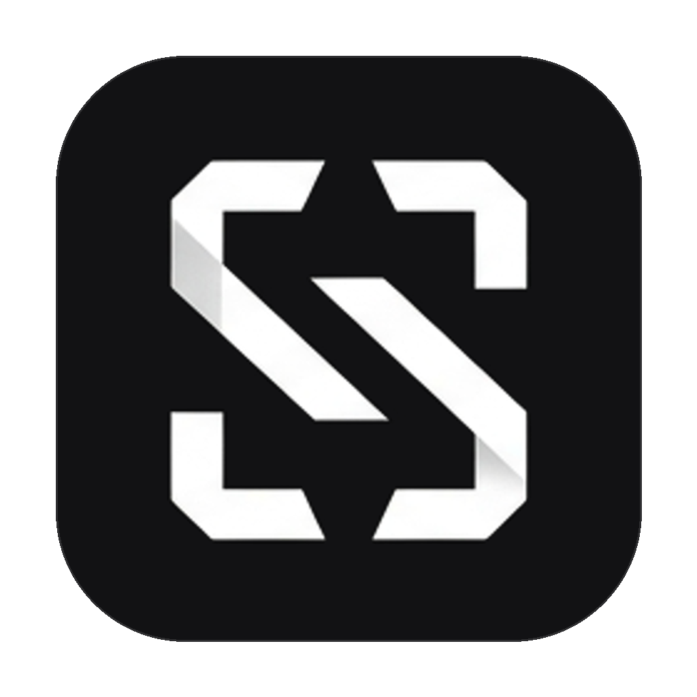

<div align="center">



# SnipLingo

**Screenshot, OCR, translation, and desktop pinning for Windows**

[](https://www.microsoft.com/windows)
[](https://tauri.app/)
[](https://www.rust-lang.org/)
[](https://www.typescriptlang.org/)
[](LICENSE)

[**简体中文**](./README.md) | [**English**](./README_EN.md)

</div>

---

## Introduction

SnipLingo is a Windows desktop tool for capturing part of the screen, recognizing its text, and translating it. Translations can appear in a separate window or over the original text in the captured image, making it useful for reading webpages, documents, and other on-screen content.

You can also keep a captured region in a floating desktop window. SnipLingo offers Windows' built-in OCR and PaddleOCR, and can use Google Translate, Baidu Translate, DeepL, or OpenAI-compatible translation APIs.

---

## Features

### 1. Screen capture
- Press `F4` by default to open the selection overlay.
- Supports multiple displays with different resolutions and DPI scaling.

### 2. Text recognition
- Choose Windows Media OCR (provided by Windows) or PaddleOCR.
- Contrast enhancement and text cleanup help with dark backgrounds and paragraph layout.

### 3. Translation
- Display translated text over the captured text, and switch between the original and translated views.
- Google Translate is available without an API key. Baidu Translate, DeepL, and OpenAI-compatible APIs are also supported, including DeepSeek, OpenRouter, Kimi, and Ollama.
- API keys, endpoints, and model settings are stored separately for each provider.
- Recent translations are kept in an in-memory cache for quick repeat lookups.

### 4. Desktop pins
- Keep a captured region in a floating desktop window. Windows are created in advance to reduce the wait when showing a pin.
- Resize pins, adjust opacity, copy or save the image, and translate it again.

### 5. Save images
- Save screenshots and pinned images as PNG, JPEG, or BMP using the native file dialog.

### 6. Windows integration
- Start with Windows and minimize to the system tray.
- Customize the global screenshot hotkey or restore the default.
- The interface is available in Simplified Chinese, Traditional Chinese, and English.

---

## Project structure

```text
SnipLingo/
├── docs/            # Project documentation and images
├── src/             # TypeScript frontend
│   ├── overlay/     # Capture overlay and selection toolbar
│   ├── pin/         # Desktop pins
│   ├── result/      # Translation result window
│   └── main.ts      # Settings UI and configuration management
├── src-tauri/       # Rust / Tauri backend
│   ├── src/commands # Frontend-to-backend IPC commands
│   ├── src/core     # Capture, OCR, translation, and system integration
│   ├── Cargo.toml   # Rust dependencies and build settings
│   └── tauri.conf.json # Window and application configuration
├── package.json     # Frontend dependencies and scripts
└── vite.config.ts   # Vite build configuration
```

---

## Tech stack

| Area | Technology | Use |
| :--- | :--- | :--- |
| **App framework** | **Tauri v2** | Builds the desktop app with Windows WebView2. |
| **Frontend** | **TypeScript + Vite** | Multi-page UI built with native DOM and CSS. |
| **Backend** | **Rust 1.77+** | Handles capture, OCR, system calls, and application logic. |
| **Screen capture** | **xcap** | Reads display information and captures screen images. |
| **OCR** | **Windows.Media.Ocr / PP-OCRv6** | Windows-native and PaddleOCR recognition engines. |
| **Networking** | **Reqwest + Tokio** | Sends translation requests and reuses HTTP connections. |

---

## Getting started

### Requirements

- **Operating system**: Windows 10 / 11 (64-bit)
- **Node.js**: `>= 18.0.0`
- **Rust toolchain**: `>= 1.77.2`; `stable-x86_64-pc-windows-msvc` is recommended
- **C++ build tools**: Visual Studio 2022 Build Tools with the “Desktop development with C++” workload
- **WebView2**: The runtime is generally included with Windows 10 / 11

### Clone and install dependencies

```powershell
git clone https://github.com/c12hua/SnipLingo.git
cd SnipLingo
npm install
```

### Run in development

```powershell
npm run tauri dev
```

Once the app starts, press `F4` to open the capture overlay.

### Run tests

```powershell
cargo test --manifest-path src-tauri/Cargo.toml
```

### Build

```powershell
npm run tauri build
```

Build artifacts are written to:
- **Installer**: `src-tauri/target/release/bundle/nsis/SnipLingo_0.1.0_x64-setup.exe`
- **Portable build**: `src-tauri/target/release/sniplingo.exe`, distributed with the adjacent `resources` directory.

---

## Configuration

User settings are stored in `%APPDATA%\SnipLingo\config.json`. Provider settings and app preferences are kept locally and are normally preserved when the app is updated or reinstalled.

---

## Contributing

Bug reports and pull requests are welcome:

1. Fork the repository.
2. Create a branch: `git checkout -b feature/your-feature`.
3. Commit your changes: `git commit -m 'feat: your commit message'`.
4. Run the tests: `cargo test --manifest-path src-tauri/Cargo.toml`.
5. Push your branch and open a pull request.

---

## License

SnipLingo is released under the [MIT](LICENSE) License.
